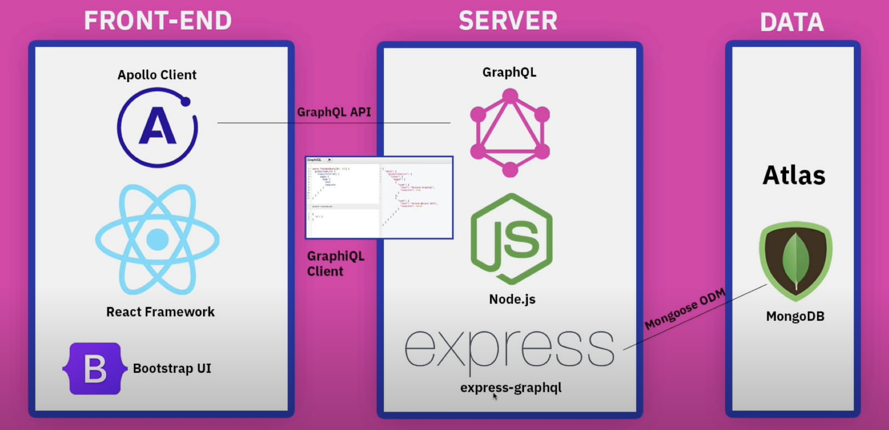

# Project Management

[](https://github.com/mdarif/project-management/actions/workflows/docker.yml) [](https://github.com/mdarif/project-management/actions/workflows/node.js.yml)


<p>
  <a href="https://github.com/git/git-scm.com/blob/main/MIT-LICENSE.txt" target="_blank">
    
  </a>
  <a href="https://twitter.com/arif_iq" target="_blank">
    
  </a>
</p>

> A MERN app about Project Management System to add/manage clients & Projects using GraphGL Server/Client.

# Architecture
A Full Stack MERN app with GraphQL Server/Client.



### How REST API works?


### How GraphQL API works?


## Stacks Used
- [Apollo GraphQL Client](https://www.apollographql.com/)
- [Bootstrap](https://getbootstrap.com/)
- [GraphQL](https://graphql.org/)
- [GraphiQL Client](https://github.com/graphql/graphiql/tree/main/packages/graphiql)
- [MongoDB](https://www.mongodb.com/)
- [Mongoose](https://mongoosejs.com/)
- [Express GraphQL](https://graphql.org/graphql-js/express-graphql/)
- [Express](https://expressjs.com/)
- [ReactJS](https://reactjs.org/)
- [NodeJS](https://nodejs.org/en/)


## Folder Structure

```
├── README.md
├── client
│   ├── Dockerfile
│   ├── README.md
│   ├── package-lock.json
│   ├── package.json
│   ├── public
│   │   ├── ...
│   └── src
│       ├── App.js
│       ├── App.test.js
│       ├── components
│       │   ├── AddClientModal.jsx
│       │   ├── AddProjectModal.jsx
│       │   ├── ClientInfo.jsx
│       │   ├── ClientRow.jsx
│       │   ├── Clients.jsx
│       │   ├── DeleteProjectButton.jsx
│       │   ├── EditProjectForm.jsx
│       │   ├── Header.jsx
│       │   ├── ProjectCard.jsx
│       │   ├── Projects.jsx
│       │   ├── Spinner.jsx
│       │   └── assets
│       │       └── logo.png
│       ├── images
│       │   ├── ...
│       ├── index.css
│       ├── index.js
│       ├── mutations
│       │   ├── clientMutations.js
│       │   └── projectMutations.js
│       ├── pages
│       │   ├── Home.jsx
│       │   ├── NotFound.jsx
│       │   └── Project.jsx
│       ├── queries
│       │   ├── clientQueries.js
│       │   └── projectQueries.js
│       ├── reportWebVitals.js
│       └── setupTests.js
├── docker-compose.yml
└── server
    ├── Dockerfile
    ├── config
    │   └── db.js
    ├── index.js
    ├── models
    │   ├── Client.js
    │   └── Project.js
    ├── package-lock.json
    ├── package.json
    ├── sampleData.js
    └── schema
        └── schema.js
```

## Automatically build & push the Full Stack Application onto Docker Hub using GitHub Actions

### What are GitHub Actions?
GitHub Actions is a continuous integration and continuous delivery (CI/CD) platform that allows you to automate your build, test, and deployment pipeline. You can create workflows that build and test every pull request to your repository, or deploy merged pull requests to production.

GitHub Actions goes beyond just DevOps and lets you run workflows when other events happen in your repository. For example, you can run a workflow to automatically add the appropriate labels whenever someone creates a new issue in your repository.

GitHub provides Linux, Windows, and macOS virtual machines to run your workflows, or you can host your own self-hosted runners in your own data center or cloud infrastructure.


### What is a Workflow?
A workflow is an automated script that runs a set of jobs when an event triggers it. The workflow script is written in a YAML file that is present in the “./github/workflows” directory path of your GitHub repository. These workflows can be triggered based on events. You can have several workflows present for various use cases, For example, you could have one workflow to build and test your application and another to deploy it.

## Developing The Workflow
Now moving on to the process of developing a workflow to deploy our full-stack application onto DockerHub. Let’s take a look at how we can develop a workflow YAML file for a full-stack application:

Our workflow YAML file is split into 2 halves one for Server Deployment & Client Deployment.

```
name: Docker CI

# Controls when the workflow will run
on:
  # Triggers the workflow on push or pull request events but only for the "master" branch
  push:
    branches: [ "master" ]
  pull_request:
    branches: [ "master" ]

  # Allows you to run this workflow manually from the Actions tab
  workflow_dispatch:

# A workflow run is made up of one or more jobs that can run sequentially or in parallel
jobs:
  # This workflow contains a single job called "Client-Deployment"
  Client-Deployment:
    # The type of runner that the job will run on
    runs-on: ubuntu-latest


  # This workflow contains a single job called "Server-Deployment"
  Server-Deployment:
    # The type of runner that the job will run on
    runs-on: ubuntu-latest
```

## Heroku Deployment

- https://mern-project-mgmt.herokuapp.com/